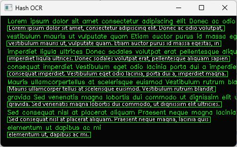
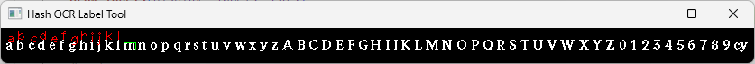

# hash-ocr

Fast OCR to read computer rendered texts.

## Installation

You can install the package via pip:

```
pip install hash-ocr
```

## Usage



```python
import cv2

from hash_ocr import MD5HashModel
from hash_ocr import draw_text_boxes

img = cv2.imread("test_data/lorem.png")
gray = cv2.cvtColor(img, cv2.COLOR_BGR2GRAY)
threshed = cv2.threshold(gray, 128, 255, cv2.THRESH_BINARY)[1]

model = MD5HashModel(
    "hash_ocr/models/segoe_ui_9.png",
    "hash_ocr/models/segoe_ui_9.json",
    connected_chars=True,
)

print(model.get_text(threshed))
# Lorem ipsum dolor sit amet consectetur adipiscing elit Donec ac odio volutpat
# vestibulum mauris ut vulputate quam Etiam auctor purus id massa egestas in
# imperdiet ligula ultrices Donec sodales volutpat erat pellentesque aliquam sapien
# consequat imperdiet Vestibulum eget odio lacinia porta dui a imperdiet magna
# Mauris ullamcorpertellus at scelerisque euismod Vestibulum rutrum blandit gravida
# Sed venenatis magna lobortis dui commodo ut dignissim elit ultricies Sed
# consequat nisl at placerat aliquam Praesent neque magna lacinia quis elementum
# ut dapibus ac mi
# Sed eget erat odio Phasellus lacinia mauris vel ex maximus pretium ln sed mattis
# felis Pellentesque sollicitudin orci sed tellus fermentum dapibus ln at urna
# condimentum velittincidunt pulvinar Quisque diam libero vehicula non mi non
# efficiturvenenatis magna ln non eros tincidunt ullamcorper sem et rhoncus augue
# Duis a dolor in ex efficitur blanditvel at eros

draw_text_boxes(img, model.get_text_boxes(threshed))

cv2.imshow("Hash OCR", img)
cv2.waitKey()
```

## Custom Models

A model in `hash-ocr` contains an image and a json file.

Example image:


Use label tool to label your image, this tool generates a json label file.

```
python -m hash_ocr.label /path/to/image
```



Example:

```python
from hash_ocr.models import MD5HashModel

model = MD5HashModel(
    model_path="hash_ocr/models/digits.png",
    label_path="hash_ocr/models/letters.json",
)
```

## License

This project is licensed under the terms of the MIT license.
