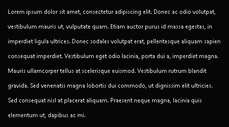
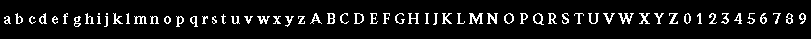
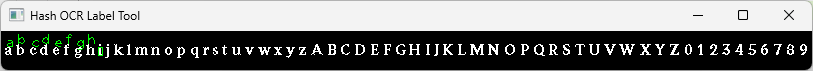

# hash-ocr

An ocr designed to read in game texts

## Installation

You can install the package via pip:

```
pip install hash-ocr
```

## Usage

Input: `test_data/lorem.png`



```python
import cv2

from hash_ocr import MD5HashModel

img = cv2.imread("test_data/lorem.png", cv2.IMREAD_GRAYSCALE)
img = cv2.threshold(img, 128, 255, cv2.THRESH_BINARY)[1]

model = MD5HashModel(
    "hash_ocr/models/segoe_ui_9.png",
    "hash_ocr/models/segoe_ui_9.json",
    connected_chars=True,
)

print(model.get_text(img))
# Lorem ipsum dolor sit amet consectetur adipiscing elit Donec ac odio volutpat
# vestibulum mauris ut vulputate quam Etiam auctor purus id massa egestas in
# imperdiet ligula ultrices Donec sodales volutpat erat pellentesque aliquam sapien
# consequat imperdiet Vestibulum eget odio lacinia porta dui a imperdiet magna
# Mauris ullamcorpertellus at scelerisque euismod Vestibulum rutrum blandit gravida
# Sed venenatis magna lobortis dui commodo ut dignissim elit ultricies Sed
# consequat nisl at placerat aliquam Praesent neque magna lacinia quis elementum
# ut dapibus ac mi
# Sed eget erat odio Phasellus lacinia mauris vel ex maximus pretium ln sed mattis
# felis Pellentesque sollicitudin orci sed tellus fermentum dapibus ln at urna
# condimentum velittincidunt pulvinar Quisque diam libero vehicula non mi non
# efficiturvenenatis magna ln non eros tincidunt ullamcorper sem et rhoncus augue
# Duis a dolor in ex efficitur blanditvel at eros

for line in model.get_text_boxes(img):
    print(line)
# ('Lorem ipsum dolor sit amet consectetur adipiscing elit Donec ac odio volutpat', (0, 3, 429, 12))
# ('vestibulum mauris ut vulputate quam Etiam auctor purus id massa egestas in', (0, 18, 422, 12))
# ('imperdiet ligula ultrices Donec sodales volutpat erat pellentesque aliquam sapien', (0, 33, 439, 12))
# ('consequat imperdiet Vestibulum eget odio lacinia porta dui a imperdiet magna', (0, 48, 435, 12))
# ('Mauris ullamcorpertellus at scelerisque euismod Vestibulum rutrum blandit gravida', (0, 63, 452, 12))
# ('Sed venenatis magna lobortis dui commodo ut dignissim elit ultricies Sed', (0, 78, 400, 12))
# ('consequat nisl at placerat aliquam Praesent neque magna lacinia quis elementum', (0, 93, 443, 12))
# ('ut dapibus ac mi', (0, 108, 101, 12))
# ('Sed eget erat odio Phasellus lacinia mauris vel ex maximus pretium ln sed mattis', (0, 138, 436, 12))
# ('felis Pellentesque sollicitudin orci sed tellus fermentum dapibus ln at urna', (0, 153, 401, 12))
# ('condimentum velittincidunt pulvinar Quisque diam libero vehicula non mi non', (0, 168, 436, 12))
# ('efficiturvenenatis magna ln non eros tincidunt ullamcorper sem et rhoncus augue', (0, 183, 452, 12))
# ('Duis a dolor in ex efficitur blanditvel at eros', (0, 198, 241, 9))

cv2.imshow("", img)
cv2.waitKey()
```

## Custom Models

A model in `hash-ocr` contains an image and a json file.

Example image:



Use label tool to label your image, this tool generates a json label file.

```
python -m hash_ocr.label /path/to/image
```



Example:

```python
from hash_ocr.models import MD5HashModel

model = MD5HashModel(
    model_path="hash_ocr/models/digits.png",
    label_path="hash_ocr/models/letters.json",
)
```

## License

This project is licensed under the terms of the MIT license.
